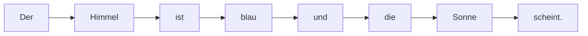

# V11: Was ist Künstliche Intelligenz?

> **Lernziele dieser Vorlesung:**
> - Verstehen, was KI ist und was sie NICHT ist
> - Erkennen, wie ein Large Language Model (LLM) funktioniert — vereinfacht
> - Halluzinationen und Grenzen von KI-Systemen kennen
> - Python-Grundlagen wiederholen: `print()`, `input()`, `if/else`, Variablen

---

## Teil 1: Theorie — Was ist Künstliche Intelligenz?

### Was ist KI eigentlich?

**Künstliche Intelligenz (KI)** ist ein Sammelbegriff für Computerprogramme, die Aufgaben erledigen, für die normalerweise menschliche Intelligenz nötig wäre — zum Beispiel Texte schreiben, Bilder erkennen oder Sprache verstehen.

> **Wichtig:** KI "denkt" nicht wie ein Mensch. KI ist ein Werkzeug, das Muster in Daten erkennt und darauf basierend Vorhersagen macht.

**Beispiele aus dem Alltag:**
- **Sprachassistenten** (Siri, Alexa): Sprache erkennen und Antworten geben
- **Navigation** (Google Maps): Beste Route berechnen
- **Empfehlungen** (Netflix, Spotify): "Das könnte dir auch gefallen"
- **ChatGPT / Copilot**: Texte schreiben, Fragen beantworten, Code generieren

### Wie funktioniert ein LLM? — Die Wort-Vorhersage-Maschine

Ein **Large Language Model** (LLM) wie ChatGPT funktioniert im Kern überraschend einfach:

> **Ein LLM liest den bisherigen Text und rät das wahrscheinlichste nächste Wort.**

Das ist wie die Autovervollständigung auf dem Handy — nur viel besser, weil das Modell mit Milliarden von Texten trainiert wurde.

**Beispiel:**
```
Eingabe:  "Der Himmel ist ___"
LLM rät:  "blau" (80% Wahrscheinlichkeit)
           "bewölkt" (10%)
           "klar" (5%)
           ...
```

Das LLM wählt ein Wort, fügt es an, und rät dann das nächste Wort — immer und immer wieder, bis ein ganzer Text entsteht.



> **Merke:** Das LLM "versteht" den Text nicht wirklich. Es berechnet nur Wahrscheinlichkeiten basierend auf Mustern, die es im Training gelernt hat.

### Woher "weiß" das LLM so viel?

Ein LLM wird auf riesigen Mengen Text trainiert:
- Wikipedia-Artikel
- Bücher
- Webseiten
- Foren und Diskussionen
- Quellcode (z.B. von GitHub)

Durch dieses Training lernt das Modell Muster: Welche Wörter folgen typischerweise aufeinander? Wie ist ein Bewerbungsschreiben aufgebaut? Wie sieht korrekter Python-Code aus?

> **Analogie:** Stell dir vor, du liest 100.000 Kochrezepte. Danach könntest du wahrscheinlich ein neues Rezept "erfinden", das plausibel klingt — auch ohne je gekocht zu haben. Genau das macht ein LLM mit Text.

### Halluzinationen — Wenn die KI "lügt"

Weil ein LLM nur Wahrscheinlichkeiten berechnet und nicht wirklich "weiß", was wahr ist, passiert Folgendes:

> **Halluzination**: Das LLM erfindet plausibel klingende, aber falsche Informationen.

**Beispiele:**
- Erfundene Studien mit realistischen Autorennamen, die nicht existieren
- Falsche Daten: "Die Zugspitze ist 3.472 m hoch" (richtig: 2.962 m)
- Nicht existierende Python-Funktionen: `string.reverse()` gibt es so nicht
- Falsche Berechnungen, die logisch klingen

**Warum passiert das?**
- Das LLM hat kein "Faktenwissen" — es hat nur Muster gelernt
- Es kann nicht zwischen wahr und falsch unterscheiden
- Wenn ein Muster plausibel genug ist, gibt es die Information aus

> **Goldene Regel:** Vertraue KI-Ausgaben nie blind! Prüfe wichtige Informationen immer nach.

### Wann KI nutzen — und wann nicht?

| ✅ Gute Anwendungsfälle | ❌ Vorsicht geboten |
|---|---|
| Texte zusammenfassen | Medizinische Diagnosen |
| Code-Vorschläge als Startpunkt | Rechtliche Beratung |
| Ideen brainstormen | Faktische Recherche ohne Prüfung |
| Übersetzungen (grob) | Entscheidungen ohne menschliche Kontrolle |
| Erklärungen für Konzepte | Bewerbungs-Vorauswahl (Bias-Gefahr!) |

### Bias — Vorurteile in der KI

Ein LLM übernimmt die Vorurteile aus seinen Trainingsdaten. Beispiel:

- Frag ein LLM nach "einem typischen Ingenieur" → es beschreibt oft einen Mann
- Frag nach "einer Krankenschwester" → es beschreibt oft eine Frau

Das sind **gesellschaftliche Stereotypen**, die im Internet weit verbreitet sind und daher ins Modell einfließen.

> **Für Maschinenbauer relevant:** Wenn KI in der Produktion eingesetzt wird (z.B. Qualitätskontrolle, Predictive Maintenance), muss man sicherstellen, dass die Trainingsdaten keine systematischen Fehler enthalten.

### Zusammenfassung Theorie

- **KI** = Computerprogramme, die menschenähnliche Aufgaben erledigen
- **LLMs** wie ChatGPT sind **Wort-Vorhersage-Maschinen**, trainiert auf riesigen Textmengen
- LLMs "verstehen" nichts — sie rechnen mit Wahrscheinlichkeiten
- **Halluzinationen** = erfundene Informationen, die plausibel klingen
- **Bias** = Vorurteile aus Trainingsdaten
- **Immer prüfen!** KI ist ein Werkzeug, kein Orakel

---

## Teil 2: Python-Praxis — Wiederholung Grundlagen

> In dieser Vorlesung wiederholen wir Python-Grundlagen, die wir in den letzten Wochen gelernt haben.
> Ziel: Sicherheit gewinnen mit `print()`, `input()`, Variablen, `if/else` und einfachen Berechnungen.

### Variablen und `print()`

```python
# Eine Variable speichert einen Wert
name = "CNC-Fräsmaschine"
baujahr = 2019
temperatur = 42.5

# print() gibt Werte auf dem Bildschirm aus
print(name)
print("Baujahr:", baujahr)
print(f"Die Temperatur beträgt {temperatur} °C")
```

### Eingaben mit `input()`

```python
# input() fragt den Benutzer nach einer Eingabe
antwort = input("Wie heißt die Maschine? ")
print(f"Du hast eingegeben: {antwort}")

# Achtung: input() gibt immer einen String zurück!
zahl_text = input("Gib eine Zahl ein: ")
zahl = int(zahl_text)  # Text in Zahl umwandeln
print(f"Das Doppelte ist: {zahl * 2}")
```

### Entscheidungen mit `if/else`

```python
temperatur = 85

if temperatur > 80:
    print("WARNUNG: Temperatur zu hoch!")
elif temperatur > 60:
    print("Temperatur im normalen Bereich.")
else:
    print("Temperatur niedrig.")
```

### Schleifen mit `for`

```python
# Eine Liste von Maschinen
maschinen = ["CNC-01", "CNC-02", "Drehbank-01"]

for maschine in maschinen:
    print(f"Prüfe Maschine: {maschine}")
```

### Zusammenfassung Python

| Konzept | Beispiel | Was es tut |
|---------|----------|------------|
| Variable | `x = 42` | Speichert einen Wert |
| `print()` | `print("Hallo")` | Gibt Text aus |
| `input()` | `input("Name? ")` | Fragt den Benutzer |
| f-String | `f"Wert: {x}"` | Text mit Variablen |
| `if/elif/else` | `if x > 10:` | Entscheidung |
| `for`-Schleife | `for i in liste:` | Wiederholt etwas |
| `int()` | `int("42")` | Text → Zahl |
