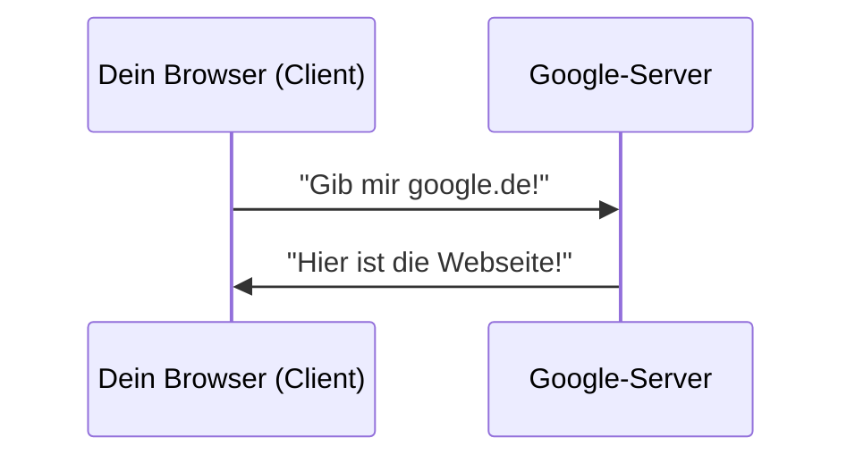

# V15: Wie funktioniert das Internet? — Netzwerke Teil 1

> **Lernziele dieser Vorlesung:**
> - Das Client-Server-Prinzip verstehen
> - Wissen, was eine IP-Adresse und ein Port ist
> - Verstehen, was passiert wenn man eine Webseite aufruft
> - Python: Funktionen definieren und verwenden (`def`, `return`)

---

## Teil 1: Theorie — Wie funktioniert das Internet?

### Das Client-Server-Prinzip

Das Internet basiert auf einem einfachen Prinzip: **Client fragt → Server antwortet**.

> **Analogie Restaurant:**
> - Du (Client) bestellst ein Essen
> - Die Küche (Server) bereitet es zu und bringt es dir
> - Du musst nicht wissen, WIE die Küche arbeitet — nur WAS du bestellen willst

**Beispiel Webseite aufrufen:**
1. Du tippst `google.de` im Browser ein (Client)
2. Dein Computer fragt den Google-Server: "Gib mir die Startseite!"
3. Der Server schickt die Webseite zurück
4. Dein Browser zeigt sie an



### IP-Adressen — Die Adresse im Internet

Jeder Computer im Internet hat eine **IP-Adresse** — wie eine Postadresse:

```
173.194.70.113    ← Das ist die IP-Adresse von Google
192.168.1.1       ← Das ist oft dein Router zu Hause
127.0.0.1         ← Das ist DEIN Computer ("localhost")
```

> **Analogie:** IP-Adresse = Straße + Hausnummer im Internet

**Warum tippen wir `google.de` statt eine Nummer?**
Weil es einen "Übersetzer" gibt: **DNS** (Domain Name System) wandelt `google.de` → `173.194.70.113` um. Wie ein Telefonbuch: Name → Nummer.

### Ports — Die Tür im Haus

Ein Server kann viele verschiedene Dienste anbieten. **Ports** unterscheiden die Dienste:

| Port | Dienst | Beispiel |
|------|--------|---------|
| 80 | HTTP (Webseiten) | `http://google.de` |
| 443 | HTTPS (Webseiten, verschlüsselt) | `https://google.de` |
| 22 | SSH (Terminal-Zugang) | Codespace-Verbindung |

> **Analogie:** IP-Adresse = Hausadresse, Port = Türnummer im Haus

### Was passiert, wenn du google.de öffnest?

1. Du tippst `google.de` ein
2. DNS übersetzt `google.de` → `173.194.70.113`
3. Dein Browser verbindet sich mit `173.194.70.113` an Port `443`
4. Der Browser fragt: "Gib mir die Startseite!" (HTTP GET-Anfrage)
5. Der Server antwortet mit dem HTML-Code der Webseite
6. Dein Browser zeigt das HTML als hübsche Seite an

### Maschinenbau-Bezug

Netzwerke sind überall in der modernen Fertigung:
- **CNC-Maschinen** sind über das Netzwerk verbunden und empfangen Programme
- **Sensoren** schicken Messwerte über das Netzwerk an einen Server
- **Industrie 4.0**: Maschinen kommunizieren miteinander (Machine-to-Machine / M2M)

### Zusammenfassung Theorie

- **Client-Server**: Client fragt, Server antwortet
- **IP-Adresse**: Eindeutige Adresse eines Computers im Netzwerk
- **Port**: "Tür" zu einem bestimmten Dienst (80 = Web, 443 = verschlüsseltes Web)
- **DNS**: Übersetzt Namen (google.de) in IP-Adressen

---

## Teil 2: Python-Praxis — Funktionen (def, return)

> Funktionen sind wiederverwendbare Code-Blöcke. Einmal schreiben, beliebig oft aufrufen!

### Eine Funktion definieren

```python
def begruessung(name):
    print(f"Hallo, {name}!")

# Funktion aufrufen
begruessung("Max")        # Hallo, Max!
begruessung("Anna")       # Hallo, Anna!
```

### Funktion mit Rückgabewert

```python
def verdopple(zahl):
    ergebnis = zahl * 2
    return ergebnis        # Gibt den Wert zurück

resultat = verdopple(21)
print(resultat)            # 42
```

### Funktion mit mehreren Parametern

```python
def maschinen_status(name, temperatur):
    if temperatur > 80:
        return f"{name}: ALARM!"
    else:
        return f"{name}: OK"

print(maschinen_status("CNC-01", 45))    # CNC-01: OK
print(maschinen_status("CNC-02", 90))    # CNC-02: ALARM!
```

### Warum Funktionen?

| Ohne Funktion | Mit Funktion |
|--------------|-------------|
| Code kopieren und anpassen | Code einmal schreiben |
| Fehler an vielen Stellen | Fehler an einer Stelle fixen |
| Schwer zu lesen | Klar strukturiert |

> **Merke:** Wenn du Code mehr als einmal brauchst → mach eine Funktion daraus!
