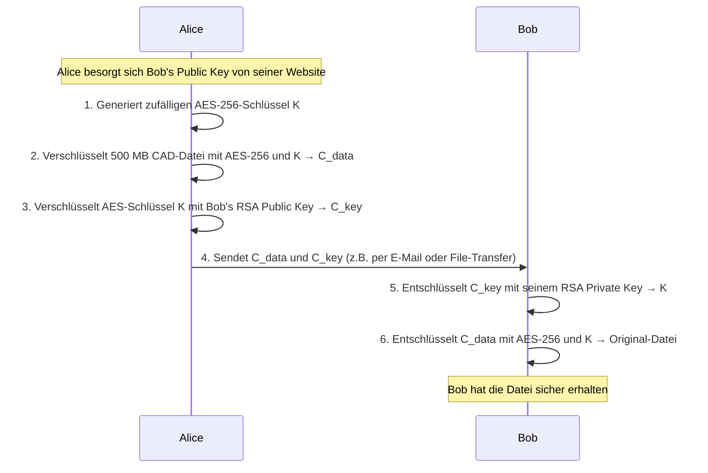
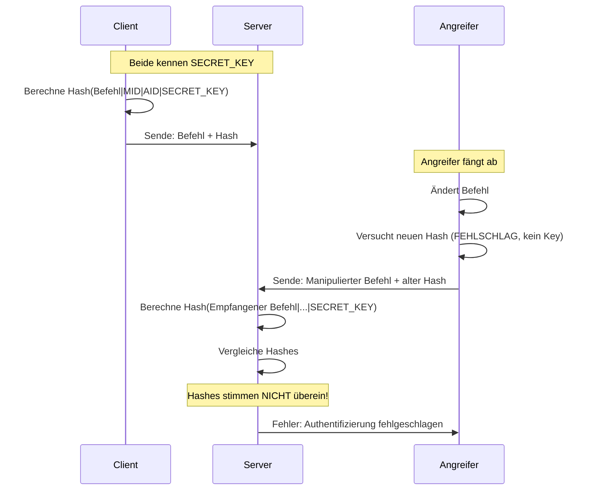

# V17: Lösungen - Kryptografie Teil 1

> [!WARNING]
> Versuche die Aufgaben zuerst selbstständig zu lösen, bevor du die Lösungen ansiehst!

---

## Teil A: Theorie-Aufgaben - Lösungen

### Lösung T1: Symmetrische vs. Asymmetrische Verschlüsselung

**Lösung**:

| Kriterium | Symmetrische Verschlüsselung | Asymmetrische Verschlüsselung |
|-----------|------------------------------|--------------------------------|
| **Schlüssel** | Ein gemeinsamer geheimer Schlüssel für Ver- und Entschlüsselung | Schlüsselpaar: Öffentlicher Schlüssel (Public Key) für Verschlüsselung, privater Schlüssel (Private Key) für Entschlüsselung |
| **Geschwindigkeit** | Sehr schnell (100-1000x schneller als asymmetrisch) | Langsam (rechenintensiv durch komplexe mathematische Operationen) |
| **Große Datenmengen** | Bestens geeignet (z.B. 1 GB Videodatei in Sekunden verschlüsselt) | Ungeeignet (würde Stunden dauern, oft sogar unmöglich wegen Blockgröße) |
| **Schlüsselaustausch** | Problematisch: Schlüssel muss vorab sicher ausgetauscht werden | Löst das Problem: Öffentlicher Schlüssel kann offen übertragen werden |
| **Beispiele** | AES, DES, 3DES, Blowfish | RSA, ECC (Elliptic Curve Cryptography), ElGamal |

**Erklärung**:

Symmetrische Verschlüsselung eignet sich hervorragend für die Verschlüsselung großer Datenmengen, da sie sehr schnell ist. Der Nachteil ist das Schlüsselaustausch-Problem: Wie tauschen zwei Parteien den geheimen Schlüssel sicher aus, wenn sie noch keine sichere Verbindung haben?

Asymmetrische Verschlüsselung löst dieses Problem, indem jeder Teilnehmer ein Schlüsselpaar besitzt. Der öffentliche Schlüssel kann frei verteilt werden. Wenn Alice etwas an Bob senden will, verschlüsselt sie es mit Bobs öffentlichem Schlüssel – nur Bob kann es mit seinem privaten Schlüssel entschlüsseln. Der Preis dafür ist die Geschwindigkeit: RSA ist etwa 1000x langsamer als AES.

In der Praxis werden beide Verfahren kombiniert (**hybride Verschlüsselung**): Ein zufälliger symmetrischer Schlüssel wird generiert und mit dem asymmetrischen Verfahren ausgetauscht, die eigentlichen Daten werden mit dem symmetrischen Verfahren verschlüsselt.

**Häufige Fehler**:
- **Verwechslung**: "Symmetrisch = schnell aber unsicherer Schlüsselaustausch" mit "Asymmetrisch = sicher aber langsam"
- **Missverständnis**: Manche denken, asymmetrische Verschlüsselung sei generell "besser". Tatsächlich hat jedes Verfahren seinen Anwendungsbereich.

---

### Lösung T2: RSA-Schlüsselgenerierung verstehen

**Lösung**:

**Schritt 1: Modulus berechnen**

$$n = p \cdot q = 11 \cdot 13 = 143$$

**Schritt 2: Euler'sche Phi-Funktion berechnen**

$$\phi(n) = (p-1)(q-1) = (11-1)(13-1) = 10 \cdot 12 = 120$$

**Schritt 3: Prüfung des öffentlichen Exponenten**

Der öffentliche Exponent $e = 7$ ist gültig, wenn $\gcd(e, \phi(n)) = 1$ gilt.

$$\gcd(7, 120) = 1$$

Da 7 eine Primzahl ist und 120 nicht durch 7 teilbar ist ($120 = 7 \cdot 17 + 1$), gilt die Bedingung. ✅

**Schritt 4: Privater Exponent**

Der private Exponent $d$ muss die Bedingung erfüllen:

$$d \cdot e \equiv 1 \mod \phi(n)$$

Testen wir $d = 103$:

$$103 \cdot 7 = 721$$

$$721 \mod 120 = 721 - 6 \cdot 120 = 721 - 720 = 1$$

Die Bedingung ist erfüllt! ✅

**Schritt 5: Schlüsselpaar**

- **Öffentlicher Schlüssel**: $(n, e) = (143, 7)$
- **Privater Schlüssel**: $(n, d) = (143, 103)$

**Erklärung**:

Die Sicherheit von RSA basiert darauf, dass es einfach ist, zwei Primzahlen zu multiplizieren ($p \cdot q = n$), aber extrem schwierig, $n$ wieder in seine Primfaktoren zu zerlegen (wenn $n$ sehr groß ist). In diesem Beispiel sind $p$ und $q$ klein, daher wäre dieses Schlüsselpaar in der Praxis unsicher. Echte RSA-Schlüssel verwenden Primzahlen mit hunderten von Stellen.

**Verifikation (optional)**: Verschlüsselung und Entschlüsselung testen:

Klartext $M = 5$:

- **Verschlüsselung**: $C = M^e \mod n = 5^7 \mod 143 = 78125 \mod 143 = 47$
- **Entschlüsselung**: $M' = C^d \mod n = 47^{103} \mod 143 = 5$ ✅

Die Berechnung von $47^{103} \mod 143$ erfolgt mittels modularer Exponentiation (Square-and-Multiply-Algorithmus).

**Lösungsweg Schritt für Schritt**:

1. Multipliziere die beiden Primzahlen
2. Berechne $(p-1) \cdot (q-1)$
3. Prüfe, ob $e$ und $\phi(n)$ teilerfremd sind (ggT = 1)
4. Berechne $d$ durch Testen oder mit dem erweiterten Euklidischen Algorithmus
5. Notiere das Schlüsselpaar

**Häufige Fehler**:
- **Verwechslung von $n$ und $\phi(n)$**: $\phi(n)$ ist **nicht** gleich $n$!
- **Falsche Modulo-Berechnung**: $(d \cdot e) \mod \phi(n)$ muss genau 1 ergeben, nicht "ungefähr 1"
- **Vergessen der Bedingung $\gcd(e, \phi(n)) = 1$**: Wenn diese nicht erfüllt ist, existiert kein gültiger privater Exponent $d$

---

### Lösung T3: Hybride Verschlüsselung analysieren

**Lösung**:

**1. Ablauf der hybriden Verschlüsselung (Schritt für Schritt)**:



**Detaillierte Schritte**:

1. Alice lädt Bobs öffentlichen RSA-Schlüssel von seiner Website herunter.
2. Alice generiert einen zufälligen AES-256-Schlüssel (32 Bytes, z.B. mit `os.urandom(32)`).
3. Alice verschlüsselt die 500 MB CAD-Datei mit AES-256 im GCM-Modus unter Verwendung des generierten Schlüssels. Ergebnis: Verschlüsselte Datei $C_{data}$ (ca. 500 MB groß).
4. Alice verschlüsselt den AES-Schlüssel $K$ (32 Bytes) mit Bobs RSA-2048-Public-Key. Ergebnis: Verschlüsselter Schlüssel $C_{key}$ (256 Bytes bei RSA-2048).
5. Alice sendet sowohl $C_{data}$ als auch $C_{key}$ an Bob (z.B. per E-Mail, Cloud-Upload oder USB-Stick).
6. Bob empfängt $C_{data}$ und $C_{key}$.
7. Bob entschlüsselt $C_{key}$ mit seinem privaten RSA-Schlüssel und erhält den AES-Schlüssel $K$.
8. Bob entschlüsselt $C_{data}$ mit dem AES-Schlüssel $K$ und erhält die Original-CAD-Datei.

**2. Warum direkte RSA-Verschlüsselung nicht funktioniert**:

**Grund 1: Blockgröße-Limitierung**
RSA-2048 kann maximal Daten der Größe $\frac{2048}{8} - 11 = 245$ Bytes verschlüsseln (bei PKCS#1 v1.5 Padding). Moderne Padding-Verfahren wie OAEP reduzieren dies weiter. Eine 500 MB Datei besteht aus $500 \cdot 1024 \cdot 1024 = 524.288.000$ Bytes. Um dies mit RSA zu verschlüsseln, müsste die Datei in etwa 2,1 Millionen Blöcke aufgeteilt und jeder Block einzeln verschlüsselt werden.

**Grund 2: Performance**
RSA ist extrem langsam. Die Verschlüsselung eines einzigen 245-Byte-Blocks dauert etwa 0,1-1 Millisekunde (je nach Hardware). Für 2,1 Millionen Blöcke würde dies etwa 35-350 Stunden (1,5-15 Tage!) dauern. AES-256 verschlüsselt die gleiche Datei in wenigen Sekunden.

**3. Rolle von AES**:

AES verschlüsselt die eigentlichen Daten, da es für große Datenmengen optimiert ist. Der AES-Schlüssel ist symmetrisch, das heißt, Alice und Bob benötigen beide denselben Schlüssel. Das Problem: Wie überträgt Alice den AES-Schlüssel sicher an Bob?

**Warum nicht per E-Mail?**
Wenn Alice den AES-Schlüssel per E-Mail sendet, könnte ein Angreifer (Eve) die E-Mail abfangen und den Schlüssel stehlen. Dann könnte Eve auch die verschlüsselte Datei entschlüsseln. Die E-Mail-Übertragung ist unsicher, weil E-Mails standardmäßig unverschlüsselt übertragen werden (es sei denn, TLS ist aktiv, aber auch dann kann der E-Mail-Provider mitlesen).

Die Lösung: Alice verschlüsselt den AES-Schlüssel mit Bobs **öffentlichem** RSA-Schlüssel. Nur Bob kann mit seinem **privaten** RSA-Schlüssel den AES-Schlüssel wieder entschlüsseln.

**4. Kann Eve die Datei entschlüsseln?**

**Nein**, Eve kann die Datei **nicht** entschlüsseln.

**Begründung**:
- Eve fängt $C_{data}$ (verschlüsselte CAD-Datei) und $C_{key}$ (verschlüsselter AES-Schlüssel) ab.
- Um $C_{data}$ zu entschlüsseln, benötigt Eve den AES-Schlüssel $K$.
- Um $C_{key}$ zu entschlüsseln, benötigt Eve Bobs **privaten** RSA-Schlüssel.
- Bob hat seinen privaten Schlüssel niemals weitergegeben oder übertragen. Er bleibt geheim auf Bobs Computer.
- Ohne den privaten Schlüssel kann Eve $C_{key}$ nicht entschlüsseln und somit nicht an $K$ gelangen.
- Ohne $K$ kann Eve $C_{data}$ nicht entschlüsseln.

Die Sicherheit basiert auf der Schwierigkeit der Primfaktorzerlegung: Eve müsste Bobs öffentlichen Schlüssel (die Zahl $n$) in seine Primfaktoren $p$ und $q$ zerlegen, um den privaten Schlüssel zu berechnen. Bei RSA-2048 ist dies praktisch unmöglich (würde Milliarden von Jahren dauern).

**5. Bonus: Was passiert bei Verwendung des falschen Schlüssels?**

Wenn Alice versehentlich **ihren eigenen privaten Schlüssel** statt **Bobs öffentlichen Schlüssel** verwendet, passiert folgendes:

- Alice verschlüsselt den AES-Schlüssel mit ihrem **privaten** RSA-Schlüssel.
- Bob versucht, den verschlüsselten Schlüssel mit seinem **privaten** RSA-Schlüssel zu entschlüsseln.
- **Das funktioniert nicht!** RSA ist nicht symmetrisch: Was mit einem privaten Schlüssel verschlüsselt wurde, kann nur mit dem zugehörigen **öffentlichen** Schlüssel entschlüsselt werden (und umgekehrt).
- Bob könnte den verschlüsselten Schlüssel mit **Alices öffentlichem Schlüssel** entschlüsseln, aber das würde bedeuten, dass jeder, der Alices öffentlichen Schlüssel hat (also potenziell jeder), ebenfalls den AES-Schlüssel entschlüsseln könnte!

**Korrekter Ablauf**:
- **Verschlüsseln für Vertraulichkeit**: Verwende den **öffentlichen Schlüssel** des Empfängers
- **Signieren für Authentizität**: Verwende den **privaten Schlüssel** des Senders (wird in V18 behandelt)

**Sehr ausführliche Erklärung**:

Hybride Verschlüsselung ist das Herzstück moderner sicherer Kommunikation (HTTPS, TLS, PGP). Sie kombiniert die Geschwindigkeit symmetrischer Verschlüsselung mit der Flexibilität asymmetrischer Verschlüsselung. Der "Trick" ist, dass nur der kleine symmetrische Schlüssel (32 Bytes bei AES-256) asymmetrisch verschlüsselt wird, nicht die gesamten Daten. Dies ist effizient und sicher.

Ein weiterer Vorteil: Der AES-Schlüssel kann für jede Übertragung neu generiert werden (**Perfect Forward Secrecy**). Selbst wenn ein Angreifer in der Zukunft Bobs privaten RSA-Schlüssel stiehlt, kann er alte verschlüsselte Nachrichten nicht entschlüsseln, da die AES-Schlüssel nur temporär existierten und nicht gespeichert wurden.

**Lösungsweg Schritt für Schritt**:

1. Identifiziere die beiden Verschlüsselungsverfahren und ihre Rollen
2. Erkläre, warum RSA für große Daten unpraktisch ist (Blockgröße + Performance)
3. Erkläre die Schlüsselverteilung: AES-Schlüssel wird mit RSA übertragen
4. Analysiere die Sicherheit: Angreifer benötigt privaten Schlüssel
5. Bonus: Verstehe die Asymmetrie von RSA (Public verschlüsselt, Private entschlüsselt)

**Alternative Lösungsansätze**:

**Ansatz 1: Diffie-Hellman-Schlüsselaustausch** (wird in V18 behandelt)
- Alice und Bob vereinbaren gemeinsam einen Schlüssel über einen unsicheren Kanal, ohne dass ein Dritter mithören kann
- ✅ Vorteil: Kein Public Key Infrastructure (PKI) notwendig
- ❌ Nachteil: Keine Authentifizierung (anfällig für Man-in-the-Middle-Angriffe)

**Ansatz 2: Pre-Shared Key**
- Alice und Bob treffen sich vorher persönlich und tauschen einen AES-Schlüssel aus
- ✅ Vorteil: Einfach, sehr sicher wenn physisch getauscht
- ❌ Nachteil: Nicht skalierbar, unpraktisch für spontane Kommunikation

**Häufige Fehler**:
- **Denken, RSA könne beliebig große Daten verschlüsseln**: RSA hat eine feste Blockgröße!
- **Verwechseln von "verschlüsseln" und "signieren"**: Beides nutzt RSA, aber für unterschiedliche Zwecke
- **Vergessen der Performance-Problematik**: Theoretisch möglich ≠ praktisch sinnvoll
- **Annahme, dass Eve den AES-Schlüssel durch Brute-Force knacken kann**: Bei AES-256 gibt es $2^{256}$ mögliche Schlüssel – praktisch unknackbar

---

## Teil B: Python-Aufgaben - Lösungen

### Lösung P1: Echo-Server und Client

**Vollständiger Code - Server** (`echo_server.py`):

```python
import socket

def start_echo_server():
    """Startet einen einfachen Echo-Server auf Port 9000."""
    
    # Socket erstellen (IPv4, TCP)
    server_socket = socket.socket(socket.AF_INET, socket.SOCK_STREAM)
    
    # An localhost:9000 binden
    server_socket.bind(("localhost", 9000))
    
    # Auf Verbindungen warten (max. 1 Verbindung in Queue)
    server_socket.listen(1)
    print("Echo-Server läuft auf Port 9000...")
    
    # Auf Client warten (blockiert bis Verbindung eingeht)
    client_socket, client_address = server_socket.accept()
    print(f"Verbindung von {client_address}")
    
    # Daten empfangen (bis zu 1024 Bytes)
    daten = client_socket.recv(1024)
    nachricht = daten.decode("utf-8")
    print(f"Empfangen: {nachricht}")
    
    # Echo zurücksenden
    antwort = f"ECHO: {nachricht}"
    client_socket.sendall(antwort.encode("utf-8"))
    print(f"Gesendet: {antwort}")
    
    # Verbindungen schließen
    client_socket.close()
    server_socket.close()
    print("Verbindung geschlossen")

if __name__ == "__main__":
    start_echo_server()
```

**Vollständiger Code - Client** (`echo_client.py`):

```python
import socket

def start_echo_client():
    """Verbindet sich mit Echo-Server und sendet eine Nachricht."""
    
    # Socket erstellen (IPv4, TCP)
    client_socket = socket.socket(socket.AF_INET, socket.SOCK_STREAM)
    
    # Mit Server verbinden
    client_socket.connect(("localhost", 9000))
    print("Verbunden mit Echo-Server")
    
    # Nachricht senden
    nachricht = "CNC-Maschine #42: Bereit"
    client_socket.sendall(nachricht.encode("utf-8"))
    print(f"Gesendet: {nachricht}")
    
    # Antwort empfangen
    daten = client_socket.recv(1024)
    antwort = daten.decode("utf-8")
    print(f"Antwort: {antwort}")
    
    # Verbindung schließen
    client_socket.close()
    print("Verbindung geschlossen")

if __name__ == "__main__":
    start_echo_client()
```

**Erklärung**:

**Server-Seite**:
1. `socket.socket(socket.AF_INET, socket.SOCK_STREAM)` erstellt einen TCP-Socket für IPv4.
2. `.bind(("localhost", 9000))` bindet den Socket an Port 9000 auf localhost.
3. `.listen(1)` versetzt den Socket in den Listening-Modus (wartet auf Verbindungen).
4. `.accept()` blockiert, bis ein Client sich verbindet. Gibt neuen Socket für Client und Client-Adresse zurück.
5. `.recv(1024)` empfängt bis zu 1024 Bytes vom Client. Rückgabe ist ein `bytes`-Objekt.
6. `.decode("utf-8")` konvertiert Bytes zu String.
7. `.sendall(...)` sendet alle Daten (blockiert bis komplett gesendet).
8. `.encode("utf-8")` konvertiert String zu Bytes.
9. `.close()` schließt die Sockets.

**Client-Seite**:
1. Socket erstellen wie beim Server.
2. `.connect(("localhost", 9000))` baut Verbindung zum Server auf (blockiert bis verbunden).
3. Nachricht senden und Antwort empfangen analog zum Server.

**Warum diese Lösung?**

Diese Lösung demonstriert die Grundlagen der Socket-Programmierung. Sie ist bewusst einfach gehalten (nur eine Verbindung) und zeigt das minimale Client-Server-Pattern. In produktiven Anwendungen würde man Error-Handling hinzufügen und den Server in einer Schleife laufen lassen.

**Häufige Fehler**:
- **Vergessen von `.encode()` / `.decode()`**: Sockets arbeiten mit Bytes, nicht Strings!
  - Fehler: `sock.sendall("Hallo")` → `TypeError: a bytes-like object is required`
  - Richtig: `sock.sendall("Hallo".encode("utf-8"))`
- **Server vor Client starten**: Der Client versucht, sich zu verbinden, aber der Server läuft nicht → `ConnectionRefusedError`
- **Port bereits in Verwendung**: Wenn der Server abstürzt, bleibt der Port blockiert → `Address already in use`
- **`.send()` statt `.sendall()`**: `.send()` garantiert nicht, dass alle Daten gesendet werden

---

### Lösung P2: CNC-Temperatur-Monitor (Client/Server)

**Vollständiger Code - Server** (`cnc_temp_server.py`):

```python
import socket
import json

def start_temperatur_server():
    """Temperatur-Monitor-Server für CNC-Maschinen."""
    
    # Socket erstellen und konfigurieren
    server_socket = socket.socket(socket.AF_INET, socket.SOCK_STREAM)
    # SO_REUSEADDR: Verhindert "Address already in use" nach Neustart
    server_socket.setsockopt(socket.SOL_SOCKET, socket.SO_REUSEADDR, 1)
    server_socket.bind(("localhost", 5555))
    server_socket.listen(1)
    
    print("Temperatur-Monitor läuft auf Port 5555...")
    
    # Auf Verbindung warten
    client_socket, client_address = server_socket.accept()
    print(f"Verbindung von {client_address}")
    
    # JSON-Daten empfangen
    daten = client_socket.recv(1024)
    json_string = daten.decode("utf-8")
    sensordaten = json.loads(json_string)
    
    # Daten auslesen
    maschine_id = sensordaten["maschine_id"]
    temperatur = sensordaten["temperatur"]
    
    print(f"Empfangen: Maschine {maschine_id}, Temperatur: {temperatur}°C")
    
    # Temperatur auswerten
    if temperatur < 60:
        status = "OK"
        meldung = "Temperatur im Normbereich"
    elif temperatur < 80:
        status = "WARNUNG"
        meldung = "Temperatur erhöht, Überwachung empfohlen"
    else:  # temperatur >= 80
        status = "KRITISCH"
        meldung = "Temperatur zu hoch! Kühlsystem prüfen!"
    
    print(f"Status: {status}")
    
    # Antwort als JSON senden
    antwort = {
        "status": status,
        "meldung": meldung
    }
    antwort_json = json.dumps(antwort)
    client_socket.sendall(antwort_json.encode("utf-8"))
    print(f"Gesendet: {antwort_json}")
    
    # Verbindungen schließen
    client_socket.close()
    server_socket.close()

if __name__ == "__main__":
    start_temperatur_server()
```

**Vollständiger Code - Client** (`cnc_temp_client.py`):

```python
import socket
import json

def send_temperatur_daten():
    """Sendet Temperatur-Daten an den Monitor-Server."""
    
    # Socket erstellen
    client_socket = socket.socket(socket.AF_INET, socket.SOCK_STREAM)
    client_socket.connect(("localhost", 5555))
    print("Verbunden mit Temperatur-Server")
    
    # Temperatur-Daten erstellen
    daten = {
        "maschine_id": "CNC-01",
        "temperatur": 85.0  # Kritischer Wert zum Testen
    }
    
    # Als JSON senden
    daten_json = json.dumps(daten)
    client_socket.sendall(daten_json.encode("utf-8"))
    print(f"Sende: {daten_json}")
    
    # Antwort empfangen
    antwort_bytes = client_socket.recv(1024)
    antwort_json = antwort_bytes.decode("utf-8")
    antwort = json.loads(antwort_json)
    
    # Antwort ausgeben
    print("Antwort vom Server:")
    print(f"  Status: {antwort['status']}")
    print(f"  Meldung: {antwort['meldung']}")
    
    # Verbindung schließen
    client_socket.close()

if __name__ == "__main__":
    send_temperatur_daten()
```

**Erklärung**:

Diese Lösung zeigt, wie strukturierte Daten (JSON) über Sockets ausgetauscht werden. JSON ist ideal für Maschinenbau-Anwendungen, da es:
- Menschenlesbar ist
- Strukturierte Daten unterstützt (verschachtelte Objekte, Arrays)
- In fast allen Programmiersprachen verfügbar ist (Python, JavaScript, C++, Java, etc.)

**Schritt-für-Schritt Durchlauf**:

1. **Server startet**: Socket wird erstellt und an Port 5555 gebunden
2. **Client startet**: Socket wird erstellt und verbindet sich mit Server
3. **Client sendet**: Dictionary wird mit `json.dumps()` zu String konvertiert, dann zu Bytes encodiert
4. **Server empfängt**: Bytes werden zu String decodiert, dann mit `json.loads()` zu Dictionary geparst
5. **Server wertet aus**: `if-elif-else` für Temperatur-Bereiche
6. **Server antwortet**: Dictionary wird zu JSON konvertiert und gesendet
7. **Client empfängt**: JSON wird geparst und Felder werden ausgegeben

**Warum `setsockopt(SOL_SOCKET, SO_REUSEADDR, 1)`?**

Wenn ein Server abstürzt oder nicht sauber beendet wird, bleibt der Port im TIME_WAIT-Status. Das Betriebssystem reserviert den Port noch für einige Zeit (30-120 Sekunden). Versucht man den Server sofort neu zu starten, erhält man "Address already in use". `SO_REUSEADDR` erlaubt es, den Port sofort wiederzuverwenden.

**Häufige Fehler**:
- **JSON-Fehler**: `json.loads()` auf nicht-JSON-String → `JSONDecodeError`
- **Dictionary-Key-Fehler**: `sensordaten["temp"]` statt `sensordaten["temperatur"]` → `KeyError`
- **Vergessen von `.encode()/.decode()`**: JSON-String muss zu Bytes konvertiert werden vor dem Senden

---

### Lösung P3: Multi-Client Sensordaten-Server

**Vollständiger Code - Server** (`sensor_server.py`):

```python
import socket
import json

def start_sensor_server():
    """Multi-Client Sensordaten-Server mit Grenzwert-Überwachung."""
    
    # Server-Socket erstellen
    server_socket = socket.socket(socket.AF_INET, socket.SOCK_STREAM)
    server_socket.setsockopt(socket.SOL_SOCKET, socket.SO_REUSEADDR, 1)
    server_socket.bind(("localhost", 6000))
    server_socket.listen(5)  # Queue für bis zu 5 Clients
    
    print("Sensor-Server läuft auf Port 6000...")
    print("Drücke Strg+C zum Beenden\n")
    
    try:
        while True:  # Endlos-Schleife für kontinuierlichen Betrieb
            # Auf nächste Verbindung warten
            client_socket, client_address = server_socket.accept()
            print(f"[Neue Verbindung] {client_address}")
            
            try:
                # Daten empfangen
                daten = client_socket.recv(4096)
                if not daten:
                    print("[Warnung] Keine Daten empfangen")
                    continue
                
                # JSON parsen
                json_string = daten.decode("utf-8")
                sensor_daten = json.loads(json_string)
                
                # Daten extrahieren
                maschine_id = sensor_daten.get("maschine_id", "Unbekannt")
                drehzahl = sensor_daten.get("drehzahl", 0)
                vibration = sensor_daten.get("vibration", 0.0)
                temperatur = sensor_daten.get("temperatur", 0.0)
                
                # Ausgabe
                print(f"Maschine {maschine_id}:")
                print(f"  - Drehzahl: {drehzahl} RPM")
                print(f"  - Vibration: {vibration} mm/s")
                print(f"  - Temperatur: {temperatur}°C")
                
                # Grenzwerte prüfen
                warnungen = []
                if drehzahl > 10000:
                    warnungen.append("Drehzahl zu hoch")
                    print("    ⚠️ WARNUNG: Drehzahl zu hoch!")
                if vibration > 5.0:
                    warnungen.append("Vibration zu hoch")
                    print("    ⚠️ WARNUNG: Vibration zu hoch!")
                if temperatur > 80:
                    warnungen.append("Temperatur zu hoch")
                    print("    ⚠️ WARNUNG: Temperatur zu hoch!")
                
                # Antwort erstellen
                antwort = {
                    "status": "OK",
                    "warnungen": warnungen
                }
                
                # Antwort senden
                antwort_json = json.dumps(antwort)
                client_socket.sendall(antwort_json.encode("utf-8"))
                print(f"[Gesendet] {antwort_json}\n")
            
            except json.JSONDecodeError:
                print("[Fehler] Ungültige JSON-Daten")
                fehler_antwort = {"status": "FEHLER", "meldung": "Ungültige JSON-Daten"}
                client_socket.sendall(json.dumps(fehler_antwort).encode("utf-8"))
            
            except Exception as e:
                print(f"[Fehler] {type(e).__name__}: {e}")
            
            finally:
                # Client-Socket immer schließen
                client_socket.close()
                print("[Verbindung geschlossen]\n")
    
    except KeyboardInterrupt:
        print("\n\n[Beende Server...]")
    
    finally:
        server_socket.close()
        print("[Server beendet]")

if __name__ == "__main__":
    start_sensor_server()
```

**Vollständiger Code - Test-Client** (`sensor_client_test.py`):

```python
import socket
import json

def send_sensor_data(daten):
    """Sendet Sensordaten an den Server und gibt Antwort aus."""
    
    try:
        # Socket erstellen und verbinden
        client_socket = socket.socket(socket.AF_INET, socket.SOCK_STREAM)
        client_socket.connect(("localhost", 6000))
        print("Verbunden mit Sensor-Server")
        
        # Daten senden
        daten_json = json.dumps(daten, indent=2)
        client_socket.sendall(daten_json.encode("utf-8"))
        print(f"Gesendet:\n{daten_json}")
        
        # Antwort empfangen
        antwort_bytes = client_socket.recv(1024)
        antwort = json.loads(antwort_bytes.decode("utf-8"))
        
        # Antwort ausgeben
        print(f"Antwort: {antwort}\n")
        
        # Socket schließen
        client_socket.close()
    
    except Exception as e:
        print(f"Fehler: {type(e).__name__}: {e}")

def main():
    """Testet den Server mit verschiedenen Szenarien."""
    
    print("=== Test 1: Normale Werte ===")
    normale_daten = {
        "maschine_id": "Drehmaschine-03",
        "drehzahl": 8500,
        "vibration": 3.2,
        "temperatur": 68.5
    }
    send_sensor_data(normale_daten)
    
    print("\n=== Test 2: Kritische Werte ===")
    kritische_daten = {
        "maschine_id": "Fräsmaschine-07",
        "drehzahl": 12000,  # Zu hoch!
        "vibration": 6.5,    # Zu hoch!
        "temperatur": 85.0   # Zu hoch!
    }
    send_sensor_data(kritische_daten)
    
    print("\n=== Test 3: Grenzwerte ===")
    grenzwerte_daten = {
        "maschine_id": "Schleifmaschine-12",
        "drehzahl": 10001,  # Knapp zu hoch
        "vibration": 5.1,   # Knapp zu hoch
        "temperatur": 79.9  # Knapp unter Grenze
    }
    send_sensor_data(grenzwerte_daten)

if __name__ == "__main__":
    main()
```

**Erklärung**:

**Konzepte in dieser Lösung**:

1. **Endlos-Schleife für Multi-Client**: `while True` ermöglicht kontinuierlichen Betrieb
2. **Error-Handling**: `try-except-finally` für robuste Fehlerbehandlung
3. **KeyboardInterrupt**: Sauberes Beenden mit Strg+C
4. **`.get()` statt `[]`**: Vermeidet KeyError bei fehlenden Feldern
5. **Grenzwert-Prüfung**: Liste von Warnungen wird dynamisch aufgebaut

**Warum `while True`?**

Ein produktiver Server soll nicht nach einer Verbindung beenden, sondern kontinuierlich Anfragen bedienen. Die Endlos-Schleife wartet nach jeder Verbindung automatisch auf die nächste. Beendet wird der Server mit Strg+C (KeyboardInterrupt).

**Warum `finally`?**

Der `finally`-Block wird **immer** ausgeführt, auch bei Exceptions. Dies garantiert, dass Client-Sockets geschlossen werden, selbst wenn ein Fehler auftritt. Sonst würden Sockets "leaken" (nicht geschlossen werden) und Ressourcen verschwenden.

**Warum `.get()` statt `[]`?**

```python
# Unsicher - wirft KeyError wenn Schlüssel fehlt:
drehzahl = sensor_daten["drehzahl"]

# Sicher - gibt Standardwert zurück wenn Schlüssel fehlt:
drehzahl = sensor_daten.get("drehzahl", 0)
```

Bei Netzwerk-Kommunikation kann man nie garantieren, dass Daten vollständig oder korrekt sind. `.get()` macht den Code robuster.

---

### Lösung P4: Roboter-Steuerungs-Protokoll

**Vollständiger Code - Server** (`robot_server.py`):

```python
import socket
import json

# Globaler Roboter-Zustand
roboter_zustand = {
    "position": [0, 0, 0],  # [x, y, z]
    "greifer_offen": True,
    "batterie": 100
}

def verarbeite_befehl(befehl_daten):
    """
    Verarbeitet einen Roboter-Befehl und gibt Antwort zurück.
    
    Args:
        befehl_daten (dict): Dictionary mit Befehlsdaten
    
    Returns:
        dict: Antwort-Dictionary
    """
    global roboter_zustand
    
    befehl = befehl_daten.get("befehl", "").upper()
    
    if befehl == "BEWEGE":
        # Position aktualisieren
        x = befehl_daten.get("x", 0)
        y = befehl_daten.get("y", 0)
        z = befehl_daten.get("z", 0)
        roboter_zustand["position"] = [x, y, z]
        
        # Batterie reduzieren
        roboter_zustand["batterie"] = max(0, roboter_zustand["batterie"] - 5)
        
        antwort = {
            "status": "OK",
            "position": roboter_zustand["position"],
            "batterie": roboter_zustand["batterie"]
        }
        print(f"  → Bewege zu Position {roboter_zustand['position']}")
    
    elif befehl == "GREIFE":
        # Greifer schließen
        roboter_zustand["greifer_offen"] = False
        roboter_zustand["batterie"] = max(0, roboter_zustand["batterie"] - 2)
        
        antwort = {
            "status": "OK",
            "greifer": "geschlossen",
            "batterie": roboter_zustand["batterie"]
        }
        print(f"  → Greifer geschlossen")
    
    elif befehl == "OEFFNE":
        # Greifer öffnen
        roboter_zustand["greifer_offen"] = True
        roboter_zustand["batterie"] = max(0, roboter_zustand["batterie"] - 2)
        
        antwort = {
            "status": "OK",
            "greifer": "offen",
            "batterie": roboter_zustand["batterie"]
        }
        print(f"  → Greifer geöffnet")
    
    elif befehl == "STATUS":
        # Aktuellen Status zurückgeben
        greifer_status = "offen" if roboter_zustand["greifer_offen"] else "geschlossen"
        antwort = {
            "position": roboter_zustand["position"],
            "greifer": greifer_status,
            "batterie": roboter_zustand["batterie"]
        }
        print(f"  → Status abgefragt")
    
    else:
        # Unbekannter Befehl
        antwort = {
            "status": "FEHLER",
            "meldung": f"Unbekannter Befehl: {befehl}"
        }
        print(f"  → Unbekannter Befehl: {befehl}")
    
    # Batterie-Warnung hinzufügen wenn kritisch
    if roboter_zustand["batterie"] <= 10:
        antwort["warnung"] = "Batterie kritisch!"
        print("  ⚠️ WARNUNG: Batterie kritisch!")
    
    return antwort

def start_robot_server():
    """Startet den Roboter-Steuerungs-Server."""
    
    server_socket = socket.socket(socket.AF_INET, socket.SOCK_STREAM)
    server_socket.setsockopt(socket.SOL_SOCKET, socket.SO_REUSEADDR, 1)
    server_socket.bind(("localhost", 7000))
    server_socket.listen(5)
    
    print("🤖 Roboter-Steuerungs-Server läuft auf Port 7000")
    print(f"Initialzustand: Position={roboter_zustand['position']}, "
          f"Greifer={'offen' if roboter_zustand['greifer_offen'] else 'geschlossen'}, "
          f"Batterie={roboter_zustand['batterie']}%")
    print("Drücke Strg+C zum Beenden\n")
    
    try:
        while True:
            client_socket, client_address = server_socket.accept()
            print(f"[Neue Verbindung] {client_address}")
            
            try:
                # Befehl empfangen
                daten = client_socket.recv(1024)
                if not daten:
                    continue
                
                befehl_daten = json.loads(daten.decode("utf-8"))
                befehl = befehl_daten.get("befehl", "UNKNOWN")
                print(f"Empfangen: {befehl}")
                
                # Befehl verarbeiten
                antwort = verarbeite_befehl(befehl_daten)
                
                # Antwort senden
                client_socket.sendall(json.dumps(antwort).encode("utf-8"))
                print(f"[Antwort] {antwort}\n")
            
            except json.JSONDecodeError:
                fehler = {"status": "FEHLER", "meldung": "Ungültige JSON-Daten"}
                client_socket.sendall(json.dumps(fehler).encode("utf-8"))
                print("[Fehler] Ungültige JSON-Daten\n")
            
            except Exception as e:
                print(f"[Fehler] {type(e).__name__}: {e}\n")
            
            finally:
                client_socket.close()
    
    except KeyboardInterrupt:
        print("\n\n[Beende Server...]")
    finally:
        server_socket.close()
        print("[Server beendet]")

if __name__ == "__main__":
    start_robot_server()
```

**Vollständiger Code - Test-Client** (`robot_client_test.py`):

```python
import socket
import json
import time

def send_befehl(befehl_dict):
    """
    Sendet einen Befehl an den Roboter-Server.
    
    Args:
        befehl_dict (dict): Dictionary mit Befehlsdaten
    
    Returns:
        dict: Antwort vom Server oder None bei Fehler
    """
    try:
        client_socket = socket.socket(socket.AF_INET, socket.SOCK_STREAM)
        client_socket.connect(("localhost", 7000))
        
        # Befehl senden
        befehl_json = json.dumps(befehl_dict)
        client_socket.sendall(befehl_json.encode("utf-8"))
        print(f"→ Gesendet: {befehl_dict['befehl']}")
        if "x" in befehl_dict:
            print(f"  Position: ({befehl_dict['x']}, {befehl_dict['y']}, {befehl_dict['z']})")
        
        # Antwort empfangen
        antwort_bytes = client_socket.recv(1024)
        antwort = json.loads(antwort_bytes.decode("utf-8"))
        print(f"← Antwort: {antwort}\n")
        
        client_socket.close()
        return antwort
    
    except Exception as e:
        print(f"Fehler: {type(e).__name__}: {e}\n")
        return None

def main():
    """Testet den Roboter-Server mit einer Befehlssequenz."""
    
    print("🤖 Roboter-Client Test\n")
    print("="*50)
    
    # Test 1: Status abfragen
    print("\n[Test 1] Status abfragen")
    send_befehl({"befehl": "STATUS"})
    time.sleep(0.5)
    
    # Test 2: Bewegen
    print("[Test 2] Bewege Roboter zu Position (100, 50, 30)")
    send_befehl({"befehl": "BEWEGE", "x": 100, "y": 50, "z": 30})
    time.sleep(0.5)
    
    # Test 3: Greifer schließen
    print("[Test 3] Greifer schließen")
    send_befehl({"befehl": "GREIFE"})
    time.sleep(0.5)
    
    # Test 4: Status prüfen
    print("[Test 4] Status nach Bewegung und Greifen")
    send_befehl({"befehl": "STATUS"})
    time.sleep(0.5)
    
    # Test 5: Mehrere Bewegungen (Batterie-Test)
    print("[Test 5] Mehrfache Bewegungen (Batterie-Test)")
    for i in range(5):
        send_befehl({"befehl": "BEWEGE", "x": i*10, "y": i*10, "z": i*10})
        time.sleep(0.3)
    
    # Test 6: Finaler Status (sollte Batterie-Warnung zeigen)
    print("[Test 6] Finaler Status")
    send_befehl({"befehl": "STATUS"})
    
    # Test 7: Unbekannter Befehl
    print("[Test 7] Unbekannter Befehl (Fehlerbehandlung)")
    send_befehl({"befehl": "SELBSTZERSTÖRUNG"})
    
    print("="*50)
    print("\n✅ Tests abgeschlossen")

if __name__ == "__main__":
    main()
```

**Erklärung**:

**Design-Entscheidungen**:

1. **Globaler Zustand**: Der Roboter-Zustand wird global gespeichert und über mehrere Verbindungen hinweg erhalten. In produktiven Anwendungen würde man eine Datenbank oder ein State-Management-System verwenden.

2. **Funktionale Dekomposition**: Die Funktion `verarbeite_befehl()` kapselt die gesamte Befehlslogik. Dies macht den Code wartbar und testbar.

3. **Batterie-Management**: `max(0, batterie - x)` verhindert negative Batterie-Werte.

4. **Fehlerbehandlung**: Unbekannte Befehle werden nicht ignoriert, sondern mit einer Fehlermeldung beantwortet.

**Komplexitätsanalyse**:

- **Zeitkomplexität**: O(1) für alle Befehle (konstante Zeit)
- **Speicherkomplexität**: O(1) (Zustand hat feste Größe)

---

### Lösung P5: Verschlüsselte Maschinen-Kommunikation

**Vollständiger Code - Server** (`secure_machine_server.py`):

```python
import socket
import json
import hashlib

# Geheimes Shared Secret (Pre-Shared Key)
SECRET_KEY = "GEHEIM_CNC_2024"

def berechne_hash(befehl, maschine_id, auftrag_id):
    """
    Berechnet SHA-256 Hash für Authentifizierung.
    
    Args:
        befehl (str): Befehlsname
        maschine_id (str): Maschinen-ID
        auftrag_id (str or None): Auftrag-ID
    
    Returns:
        str: Hexadezimaler Hash-String
    """
    # String erstellen: befehl|maschine_id|auftrag_id|SECRET_KEY
    data_string = f"{befehl}|{maschine_id}|{auftrag_id or ''}|{SECRET_KEY}"
    
    # SHA-256 Hash berechnen
    hash_object = hashlib.sha256(data_string.encode("utf-8"))
    return hash_object.hexdigest()

def verarbeite_befehl(befehl, maschine_id, auftrag_id):
    """
    Führt authentifizierten Befehl aus.
    
    Args:
        befehl (str): Befehlsname
        maschine_id (str): Maschinen-ID
        auftrag_id (str or None): Auftrag-ID
    
    Returns:
        str: Ausführungs-Meldung
    """
    if befehl == "START_PRODUKTION":
        return f"✅ Produktion gestartet für Auftrag {auftrag_id or 'N/A'}"
    elif befehl == "STOPP_PRODUKTION":
        return "⏹️ Produktion gestoppt"
    elif befehl == "NOTAUS":
        return "🚨 NOTAUS aktiviert!"
    else:
        return f"Unbekannter Befehl: {befehl}"

def start_secure_server():
    """Startet den sicheren Maschinen-Server mit HMAC-ähnlicher Authentifizierung."""
    
    server_socket = socket.socket(socket.AF_INET, socket.SOCK_STREAM)
    server_socket.setsockopt(socket.SOL_SOCKET, socket.SO_REUSEADDR, 1)
    server_socket.bind(("localhost", 8000))
    server_socket.listen(5)
    
    print("🔒 Secure Machine Server läuft auf Port 8000")
    print(f"Shared Secret: {SECRET_KEY}")
    print("Drücke Strg+C zum Beenden\n")
    
    try:
        while True:
            client_socket, client_address = server_socket.accept()
            print(f"[Neue Verbindung] {client_address}")
            
            try:
                # Daten empfangen
                daten = client_socket.recv(4096)
                if not daten:
                    continue
                
                befehl_daten = json.loads(daten.decode("utf-8"))
                
                # Felder extrahieren
                befehl = befehl_daten.get("befehl", "")
                maschine_id = befehl_daten.get("maschine_id", "")
                auftrag_id = befehl_daten.get("auftrag_id")
                empfangener_hash = befehl_daten.get("hash", "")
                
                print(f"Empfangen: {befehl} für {maschine_id}, Auftrag {auftrag_id or 'N/A'}")
                
                # Erwarteten Hash berechnen
                erwarteter_hash = berechne_hash(befehl, maschine_id, auftrag_id)
                
                # Hash-Verifizierung
                if empfangener_hash == erwarteter_hash:
                    print("Hash-Verifizierung: ✅ Authentisch")
                    
                    # Befehl ausführen
                    meldung = verarbeite_befehl(befehl, maschine_id, auftrag_id)
                    print(meldung)
                    
                    antwort = {
                        "status": "OK",
                        "meldung": "Befehl authentifiziert und ausgeführt"
                    }
                else:
                    print("Hash-Verifizierung: ❌ Fehlgeschlagen (manipulierter Hash)")
                    print(f"  Erwartet: {erwarteter_hash[:16]}...")
                    print(f"  Empfangen: {empfangener_hash[:16]}...")
                    print("Befehl abgelehnt!")
                    
                    antwort = {
                        "status": "FEHLER",
                        "meldung": "Authentifizierung fehlgeschlagen!"
                    }
                
                # Antwort senden
                client_socket.sendall(json.dumps(antwort).encode("utf-8"))
                print(f"[Gesendet] {antwort}\n")
            
            except json.JSONDecodeError:
                fehler = {"status": "FEHLER", "meldung": "Ungültige JSON-Daten"}
                client_socket.sendall(json.dumps(fehler).encode("utf-8"))
                print("[Fehler] Ungültige JSON-Daten\n")
            
            except Exception as e:
                print(f"[Fehler] {type(e).__name__}: {e}\n")
            
            finally:
                client_socket.close()
    
    except KeyboardInterrupt:
        print("\n\n[Beende Server...]")
    finally:
        server_socket.close()
        print("[Server beendet]")

if __name__ == "__main__":
    start_secure_server()
```

**Vollständiger Code - Client** (`secure_machine_client.py`):

```python
import socket
import json
import hashlib

# Geheimes Shared Secret (MUSS identisch mit Server sein!)
SECRET_KEY = "GEHEIM_CNC_2024"

def berechne_hash(befehl, maschine_id, auftrag_id):
    """
    Berechnet SHA-256 Hash für Authentifizierung.
    
    Args:
        befehl (str): Befehlsname
        maschine_id (str): Maschinen-ID
        auftrag_id (str or None): Auftrag-ID
    
    Returns:
        str: Hexadezimaler Hash-String
    """
    data_string = f"{befehl}|{maschine_id}|{auftrag_id or ''}|{SECRET_KEY}"
    hash_object = hashlib.sha256(data_string.encode("utf-8"))
    return hash_object.hexdigest()

def send_command(befehl, maschine_id, auftrag_id=None, manipuliere_hash=False):
    """
    Sendet authentifizierten Befehl an den Server.
    
    Args:
        befehl (str): Befehlsname
        maschine_id (str): Maschinen-ID
        auftrag_id (str or None): Auftrag-ID (optional)
        manipuliere_hash (bool): Wenn True, sende falschen Hash zum Testen
    
    Returns:
        dict: Antwort vom Server oder None bei Fehler
    """
    try:
        client_socket = socket.socket(socket.AF_INET, socket.SOCK_STREAM)
        client_socket.connect(("localhost", 8000))
        
        # Hash berechnen
        if manipuliere_hash:
            hash_value = "FALSCHER_HASH_12345"
            print("⚠️ WARNUNG: Manipulierter Hash wird gesendet!")
        else:
            hash_value = berechne_hash(befehl, maschine_id, auftrag_id)
        
        # Befehl erstellen
        befehl_dict = {
            "befehl": befehl,
            "maschine_id": maschine_id,
            "auftrag_id": auftrag_id,
            "hash": hash_value
        }
        
        # Senden
        befehl_json = json.dumps(befehl_dict, indent=2)
        client_socket.sendall(befehl_json.encode("utf-8"))
        print(f"→ Gesendet: {befehl} für {maschine_id}, Auftrag {auftrag_id or 'N/A'}")
        print(f"  Hash: {hash_value[:32]}...")
        
        # Antwort empfangen
        antwort_bytes = client_socket.recv(1024)
        antwort = json.loads(antwort_bytes.decode("utf-8"))
        print(f"← Antwort: {antwort}\n")
        
        client_socket.close()
        return antwort
    
    except Exception as e:
        print(f"Fehler: {type(e).__name__}: {e}\n")
        return None

def main():
    """Testet den sicheren Server mit verschiedenen Szenarien."""
    
    print("🔒 Secure Machine Client Test")
    print(f"Shared Secret: {SECRET_KEY}")
    print("="*60 + "\n")
    
    # Test 1: Normale, authentifizierte Befehle
    print("[Test 1] Produktionsstart (authentifiziert)")
    send_command("START_PRODUKTION", "CNC-05", "A12345")
    
    print("[Test 2] Produktionsstopp (authentifiziert)")
    send_command("STOPP_PRODUKTION", "CNC-05")
    
    print("[Test 3] Notaus (authentifiziert)")
    send_command("NOTAUS", "CNC-05")
    
    # Test 4: Manipulierter Hash (sollte abgelehnt werden)
    print("[Test 4] START_PRODUKTION mit manipuliertem Hash")
    send_command("START_PRODUKTION", "CNC-05", "A99999", manipuliere_hash=True)
    
    # Test 5: Weiterer authentifizierter Befehl nach Manipulation
    print("[Test 5] Erneuter authentifizierter Befehl")
    send_command("START_PRODUKTION", "CNC-05", "A67890")
    
    print("="*60)
    print("\n✅ Tests abgeschlossen")

if __name__ == "__main__":
    main()
```

**Sehr ausführliche Erklärung**:

**Sicherheitskonzept:**

Diese Lösung implementiert eine **Message Authentication Code (MAC)**-ähnliche Authentifizierung. Sie simuliert, wie in der Praxis Nachrichten gegen Manipulation geschützt werden.

**Funktionsweise:**

1. **Shared Secret**: Beide Seiten (Client und Server) kennen ein gemeinsames Geheimnis (`SECRET_KEY`). Dieses muss vorher auf sicherem Weg ausgetauscht werden (z.B. physische Übergabe, verschlüsselter Kanal).

2. **Hash-Berechnung**: Der Client erstellt einen String aus Befehl, Maschinen-ID, Auftrag-ID und dem Secret Key. Daraus wird ein SHA-256-Hash berechnet.

3. **Übertragung**: Client sendet Befehl **und** Hash an Server.

4. **Verifizierung**: Server empfängt Befehl und Hash. Server berechnet selbst den erwarteten Hash aus den empfangenen Daten und dem Secret Key. Wenn beide Hashes übereinstimmen, ist die Nachricht authentisch.

5. **Sicherheit**: Ein Angreifer kann den Befehl nicht manipulieren, da er den Secret Key nicht kennt und somit keinen gültigen Hash berechnen kann.

**Warum ist das sicher?**

- **SHA-256 ist eine kryptografische Hash-Funktion**: Selbst eine minimale Änderung im Input führt zu einem völlig anderen Output (Avalanche-Effekt).
- **One-Way-Funktion**: Aus dem Hash kann man den Secret Key nicht zurückrechnen.
- **Kollisionsresistenz**: Es ist praktisch unmöglich, zwei unterschiedliche Inputs zu finden, die denselben Hash ergeben.

**Angriffs-Szenarien:**

**Szenario 1: Angreifer fängt Nachricht ab und ändert Befehl**
- Angreifer ändert `"START_PRODUKTION"` zu `"NOTAUS"`
- Hash passt nicht mehr zum neuen Befehl
- Server lehnt ab ✅

**Szenario 2: Angreifer fängt Nachricht ab und berechnet neuen Hash**
- Angreifer kennt Secret Key nicht
- Kann keinen gültigen Hash berechnen
- Server lehnt ab ✅

**Szenario 3: Replay-Angriff** (nicht implementiert, aber in Praxis relevant)
- Angreifer fängt gültige Nachricht ab und sendet sie erneut
- Diese Lösung hat **keinen** Replay-Schutz
- In Praxis: Verwende Nonce (Number used once) oder Timestamp

**Architektur-Überblick:**



**Schritt-für-Schritt Erklärung:**

**Client-Seite:**
1. Befehl, Maschinen-ID und Auftrag-ID werden definiert
2. String wird erstellt: `"START_PRODUKTION|CNC-05|A12345|GEHEIM_CNC_2024"`
3. SHA-256 Hash wird berechnet: `hashlib.sha256(string.encode()).hexdigest()`
4. JSON-Objekt mit Befehl UND Hash wird erstellt
5. JSON wird als Bytes gesendet

**Server-Seite:**
1. Empfange JSON-Daten
2. Parse JSON: Extrahiere Befehl, Maschinen-ID, Auftrag-ID, Hash
3. Berechne erwarteten Hash aus empfangenen Daten + SECRET_KEY
4. Vergleiche empfangenen Hash mit erwartetem Hash
5. Bei Übereinstimmung: Führe Befehl aus
6. Bei Abweichung: Lehne ab mit Fehlermeldung

**Alternative Lösungsansätze:**

**Ansatz 1: HMAC (Hash-based Message Authentication Code)** – Standard-Bibliothek
```python
import hmac
hash_value = hmac.new(SECRET_KEY.encode(), data.encode(), hashlib.sha256).hexdigest()
```
- ✅ Vorteil: Standardisiert, sicherer gegen bestimmte Angriffe
- ❌ Nachteil: Benötigt `hmac`-Modul (aber in Standard-Bibliothek enthalten)

**Ansatz 2: Asymmetrische Signatur (RSA, ECC)**
- Client signiert Nachricht mit privatem Schlüssel
- Server verifiziert Signatur mit öffentlichem Schlüssel
- ✅ Vorteil: Kein Shared Secret nötig, Non-Repudiation
- ❌ Nachteil: Langsamer, komplexer

**Ansatz 3: TLS/SSL mit Zertifikaten**
- Verwende `ssl`-Modul für verschlüsselte und authentifizierte Sockets
- ✅ Vorteil: Industriestandard, sehr sicher
- ❌ Nachteil: Benötigt Zertifikate, komplexer Setup

Wir haben die SHA-256-basierte Lösung gewählt, weil sie:
- Einfach zu verstehen ist (didaktisch wertvoll)
- Nur Standard-Bibliotheken benötigt
- Das Grundprinzip der Authentifizierung demonstriert
- In der Praxis ähnlich funktioniert (HMAC ist eine Erweiterung davon)

---